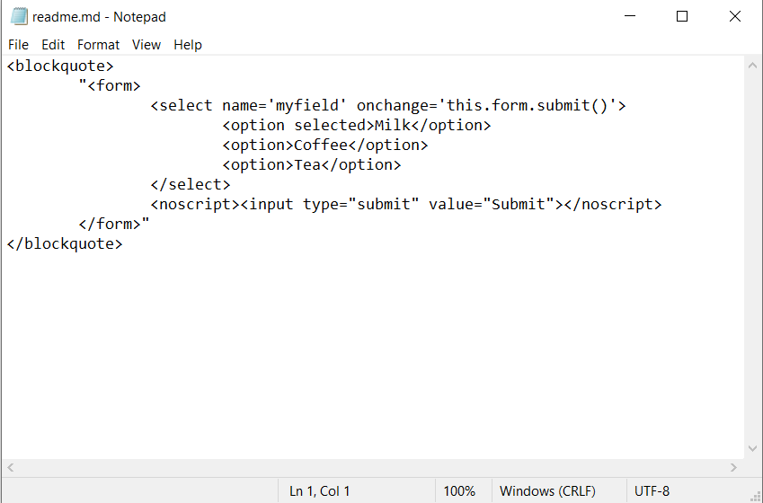

<h2>How To Set Submit a Form Onchange/ selecting Any Option Simply ??</h2>
<blockquote>

	<form>
		<select name='myfield' onchange='this.form.submit()'>
			<option selected>Milk</option>
			<option>Coffee</option>
			<option>Tea</option>
		</select>
		<noscript><input type="submit" value="Submit"></noscript>
	</form>

</blockquote>

