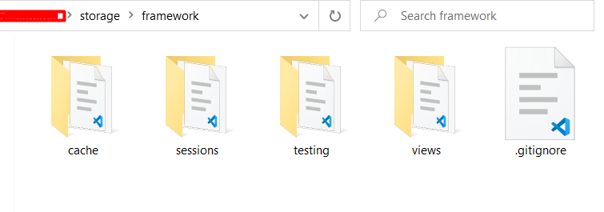

	<h2>after executing command : <strong>composer install</strong>, I got the error:</h2>
	<h2>How to Solve this ??</h2>
	<strong>
		[InvalidArgumentException] Please provide a valid cache path ...
	</strong>
	  
	

		<u><b>solution:</b></u> 
		Create these folders under <u>storage/framework</u>:
	

	<blockquote>sessions</blockquote>
	<blockquote>views</blockquote>
	<blockquote>cache</blockquote>
	
And Then use this command to install:

	<blockquote>sudo composer install</blockquote>
	<h3>Now its <u>worked</u>!</h3>
	

